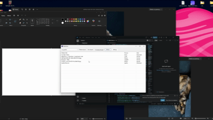
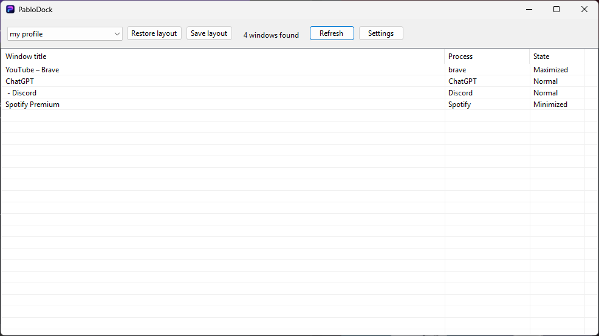
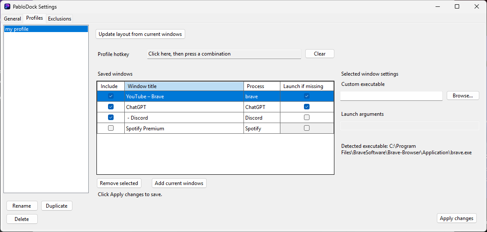
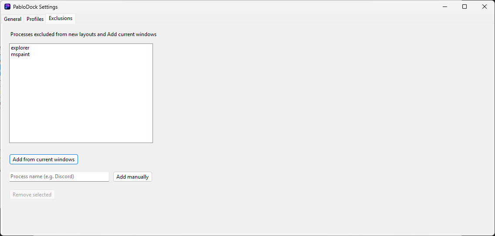
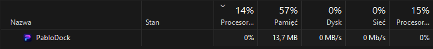

# PabloDock

PabloDock is a small, lightweight Windows 11 utility for saving and restoring multi-monitor window layouts. This is an early release.

## Why PabloDock?

PabloDock started because a friend uses a four-monitor setup with mostly the same applications in the same places every day. Manually arranging Discord, Spotify, browsers, and other windows after startup became repetitive. PabloDock solves that with saved workspace profiles, one-click or keybind restore, automatic launching of missing apps, and multi-monitor support.

It is designed to stay quietly in the system tray. The goal is effectively idle CPU use when no work is running. During testing, memory use has typically been around 20–40 MB; actual usage varies by system and workload.

## Demo



## Screenshots

### Main window



### Profile management



### Global exclusions



### Lightweight when idle



## Features

- Save the current desktop windows as named profiles and restore their positions, monitor placement, and window states.
- Manage saved windows, profile hotkeys, and per-window launch settings in **Settings**.
- Restore profiles from the system tray or with configurable global hotkeys while PabloDock is running.
- Launch missing applications during restore when a usable executable or packaged-app identity is available. A custom executable and arguments can be set for a saved window.
- Optionally start with Windows, hidden in the tray, and restore a selected profile after startup.
- Exclude processes globally from newly captured layouts. Existing profiles are unaffected by new exclusions.

## Basic usage

Run `PabloDock.exe`, then choose **Save layout** to name a profile. Select a profile and click **Restore layout** to put matching running windows back in place. PabloDock can launch missing applications when the saved window allows it. Closing the main window hides it in the tray; use the tray menu to open it, restore a profile, or exit. Configure hotkeys, startup, profile windows, and exclusions in **Settings**.

Profiles are stored as JSON under `%LOCALAPPDATA%\PabloDock\Profiles`.

## Download

For normal use, download the latest Windows x64 binary from [GitHub Releases](https://github.com/wejrd/PabloDock/releases) instead of cloning the source repository. The release build includes .NET, so a separate .NET installation is not needed.

## Build from source

Install the .NET 10 SDK on Windows 11, then run:

```powershell
dotnet build PabloDock.csproj -c Release
```

To create the self-contained, single-file Windows x64 release build:

```powershell
dotnet publish PabloDock.csproj -c Release -p:PublishProfile=WinX64
```

The publish output is in `artifacts\publish\win-x64\`.
